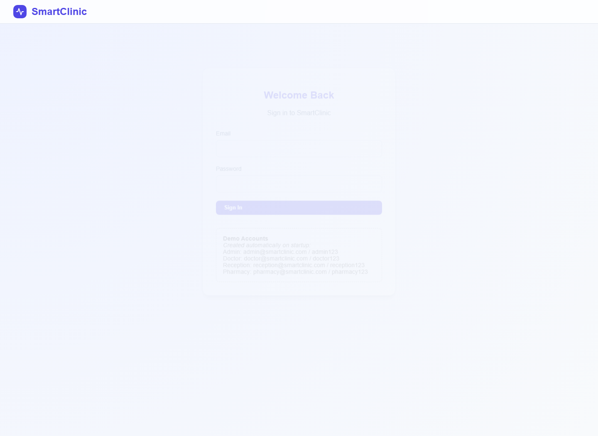
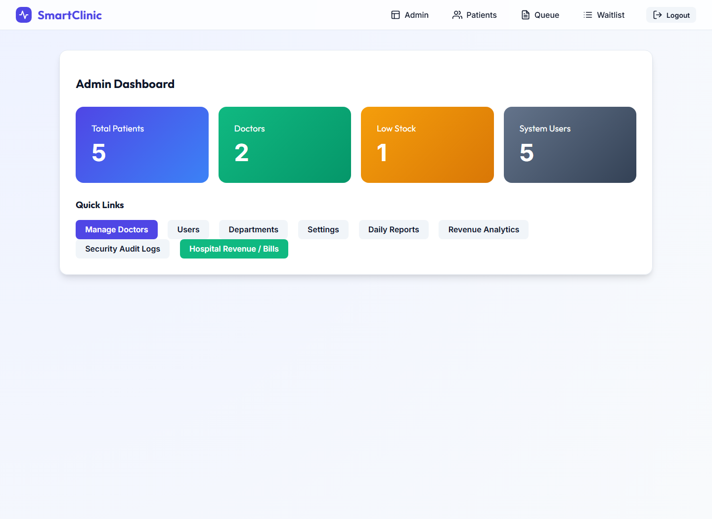
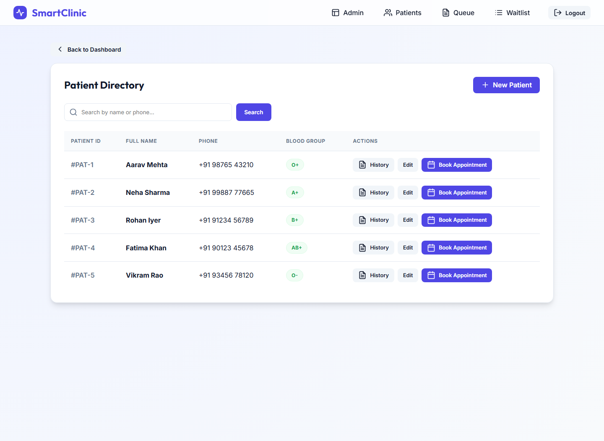
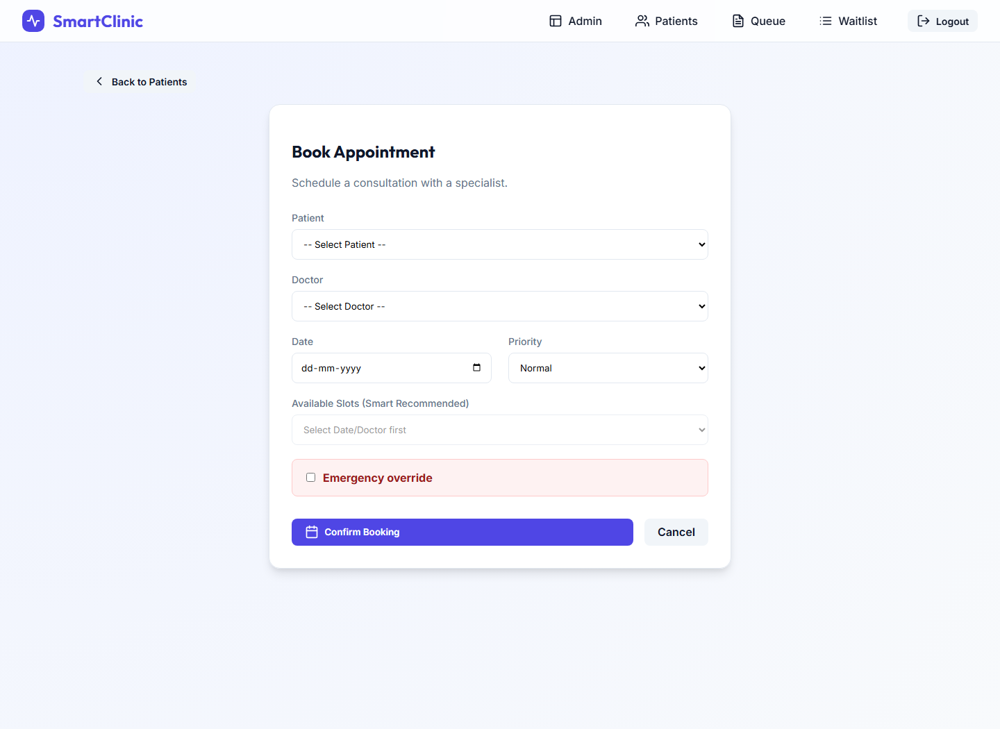
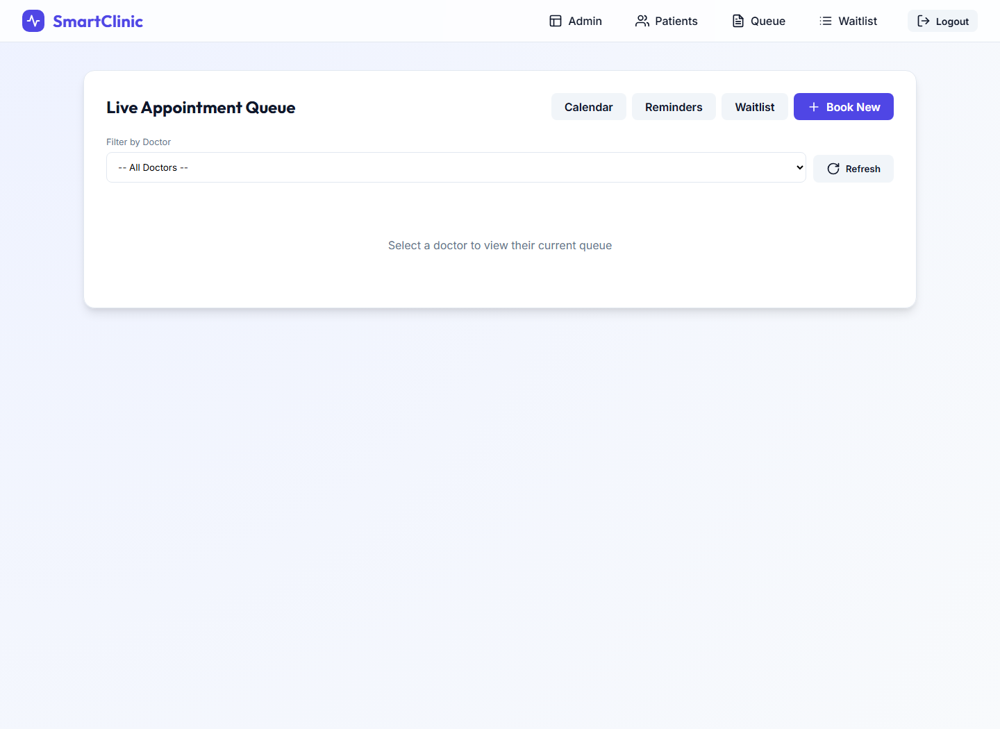
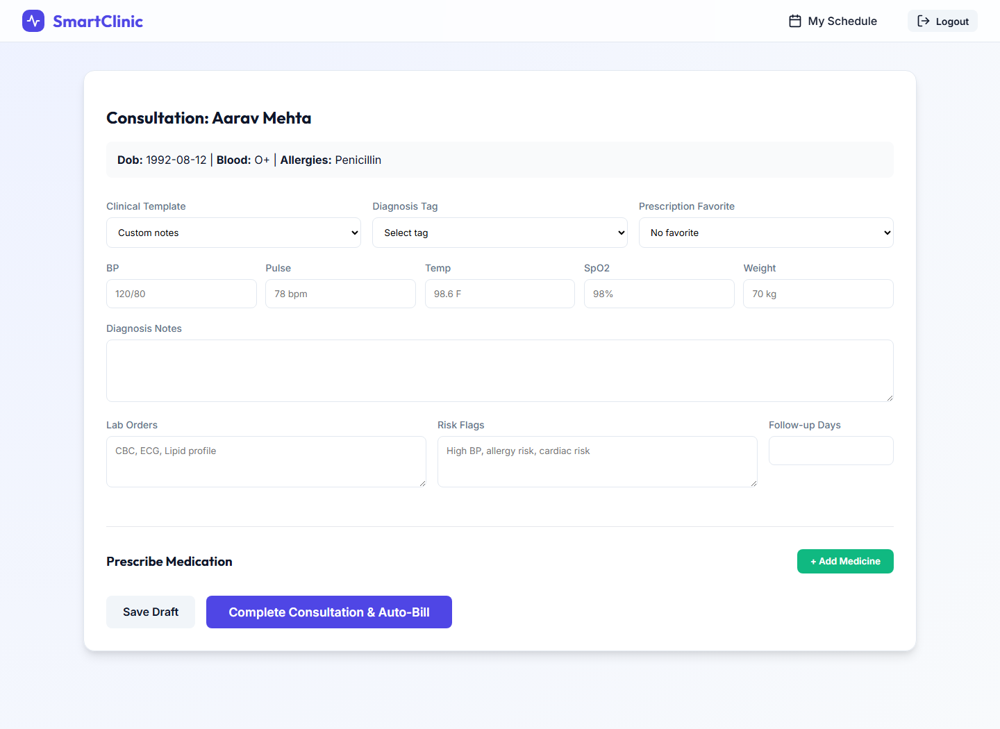
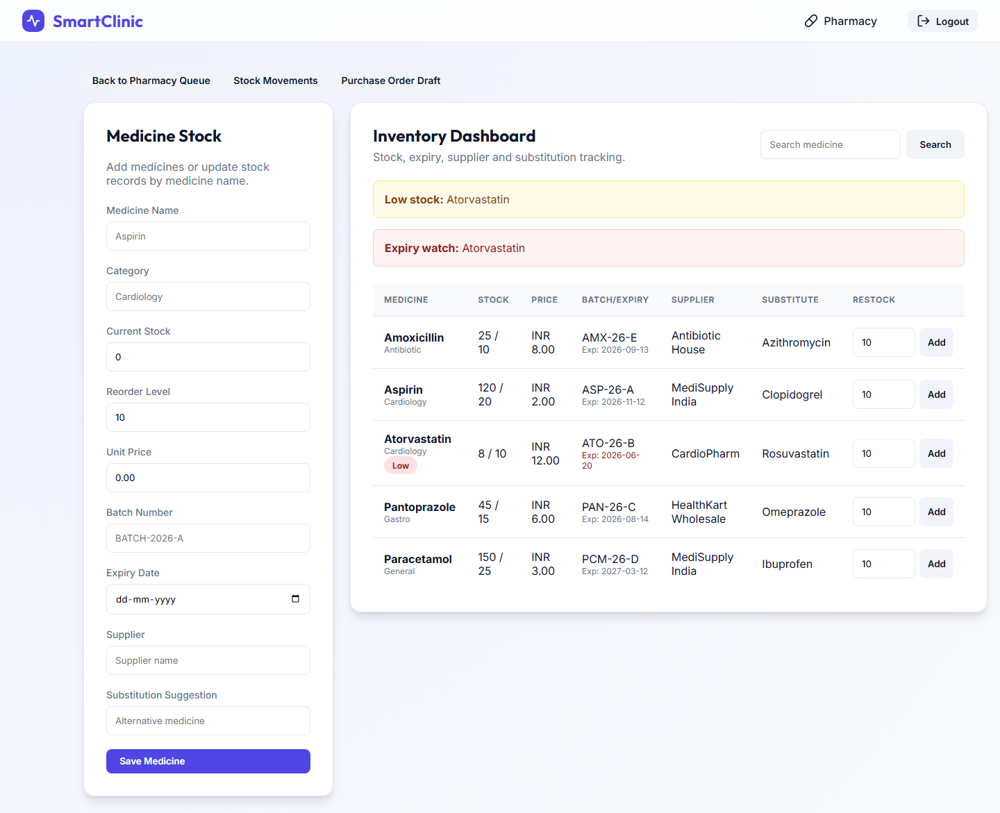
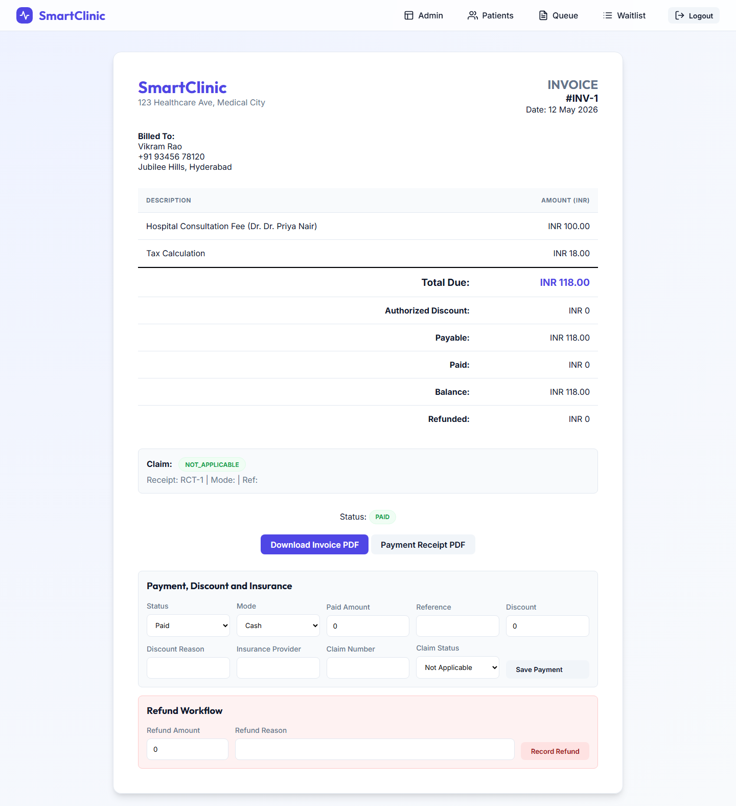

# SmartClinic - Smart Hospital Management System


**Live Demo:** [smartclinicmanagementsystem-production.up.railway.app](https://smartclinicmanagementsystem-production.up.railway.app)

🏥 **SmartClinic** is a full-stack Java web application for managing clinic and hospital operations across admin, reception, doctor, pharmacy, and billing workflows. It is built with a classic Spring MVC + JSP architecture, Hibernate ORM, MySQL, Spring Security, and Dockerized Tomcat deployment.

This repository is designed as a portfolio-ready backend engineering project. It demonstrates layered Java architecture, role-based authentication, real database relationships, transactional business logic, server-rendered UI flows, REST endpoints, and deployable infrastructure.

## Portfolio Positioning

| Item | Suggested text |
| --- | --- |
| Project subtitle | Role-Based Hospital Operations Platform |
| Repository description | Java 17 Spring MVC hospital management system with Hibernate, MySQL, JSP, Spring Security, billing, pharmacy, audit logs, and Docker deployment. |
| Portfolio one-liner | Built a production-style Java web application that manages clinic operations across admin, reception, doctor, pharmacy, and billing workflows. |

## Project Overview

SmartClinic models the operational flow of a small hospital:

1. Admin configures users, doctors, departments, consultation fees, reports, revenue analytics, and audit logs.
2. Reception registers patients, searches records, books appointments, manages live queues, sends mock reminders, and handles waitlists.
3. Doctors view schedules, capture consultation details, write prescriptions, save drafts, complete visits, and trigger billing.
4. Pharmacists dispense prescriptions, validate stock availability, restock inventory, and track stock movements.
5. Admins manage invoices, payments, discounts, insurance claim details, refunds, PDFs, and CSV exports.

The application is not only CRUD. It includes business rules such as smart slot allocation, doctor leave blocking, appointment priority handling, automatic waitlist notification, prescription-driven inventory deduction, billing tax calculation, and end-to-end audit trails.

## Key Features

| Module | Implemented functionality |
| --- | --- |
| Authentication | Spring Security form login, BCrypt passwords, logout flow, CSRF protection, role-based navigation, and session-based access control. |
| Admin | Dashboard metrics, user management with activate/deactivate controls, doctor CRUD, doctor leave blocking, departments, system settings, daily reports, revenue analytics, audit filters, and CSV exports. |
| Reception | Patient registration/edit/search, patient history, appointment booking, queue tokens, check-in/no-show, reschedule, cancel, calendar, waitlist, and mock SMS/email reminders. |
| Doctor | Doctor schedule, profile, consultation form, clinical templates, diagnosis tags, vitals, lab orders, risk flags, follow-up days, prescription favorites, drafts, and completed visits. |
| Pharmacy | Pending prescription queue, medicine inventory, restocking, low-stock alerts, expiry watch, supplier/batch tracking, substitution suggestions, stock movements, and purchase-order draft. |
| Billing | Auto-generated invoices, consultation fee settings, MySQL stored procedure tax calculation with Java fallback, payment status, partial payments, discounts, insurance data, refunds, invoice PDFs, and receipt PDFs. |
| Auditability | Servlet filter logs route access, services log important business events, and appointment timelines show operational history. |
| REST APIs | JSON endpoints for patients, doctors, appointments, prescriptions, and billing using Spring MVC `@RestController` and Jackson. |
| Testing | Focused JUnit 5 and Mockito tests for slot allocation, appointment workflows, and medicine dispensing rules. |

## Tech Stack

| Layer | Technology |
| --- | --- |
| Language | Java 17 |
| Web framework | Spring MVC 5.3.27 |
| Security | Spring Security 5.8.3, BCrypt, CSRF |
| View layer | JSP, JSTL, Spring Security JSP tags |
| ORM | Hibernate 5.6.15, Hibernate Validator, Ehcache second-level cache |
| Database | MySQL 8.0 |
| Connection pooling | Apache Commons DBCP2 |
| JSON APIs | Jackson Databind with Java Time module |
| PDF generation | iText 7 |
| Build | Maven WAR packaging |
| Runtime | Tomcat 9 in Docker, Jetty Maven plugin for local development |
| Tests | JUnit 5, Mockito |
| Deployment | Dockerfile, Docker Compose, Render blueprint |

## Architecture

SmartClinic follows a layered MVC architecture with clear separation between request handling, business logic, persistence, and presentation.

```text
Browser
  |
  v
Spring Security Filter Chain
  |
  v
Spring MVC DispatcherServlet
  |
  v
Controllers / REST Controllers
  |
  v
Service Layer (@Transactional business logic)
  |
  v
DAO Layer (Hibernate SessionFactory)
  |
  v
MySQL Database
```

### MVC Implementation

| Layer | Package or path | Responsibility |
| --- | --- | --- |
| View | `src/main/webapp/WEB-INF/views` | JSP pages for admin, appointments, billing, doctor, patients, pharmacy, layout, and error screens. |
| Controller | `src/main/java/com/smartclinic/controller` | Spring MVC routes, form handling, REST endpoints, redirects, and model binding. |
| Service | `src/main/java/com/smartclinic/service` | Transactional business workflows such as slot allocation, billing, dispensing, waitlist updates, and user loading. |
| DAO | `src/main/java/com/smartclinic/dao` | Hibernate queries and reusable CRUD operations through `GenericDaoImpl`. |
| Model | `src/main/java/com/smartclinic/model` | JPA/Hibernate entities mapped to MySQL tables. |
| Config | `src/main/java/com/smartclinic/config` | Spring root context, MVC config, security config, servlet initializer, and Hibernate setup. |
| Utility | `src/main/java/com/smartclinic/util` | Slot allocation, pagination, PDF generation, and demo data seeding. |

### Important Architecture Details

- `WebConfig` enables Spring MVC, resolves JSP views from `/WEB-INF/views/*.jsp`, serves `/resources/**`, and configures Jackson for Java time values.
- `AppConfig` creates the DBCP datasource, Hibernate `SessionFactory`, Hibernate properties, and `HibernateTransactionManager`.
- `SecurityConfig` defines URL-level authorization for `ADMIN`, `DOCTOR`, `RECEPTIONIST`, and `PHARMACIST`.
- `WebAppInitializer` configures the DispatcherServlet without a legacy `web.xml`.
- `SecurityWebApplicationInitializer` registers the Spring Security filter chain.
- `AuditFilter` records route access and current user context into `audit_log`.

## Folder Structure

```text
Smart_Hospital_Management/
|-- pom.xml
|-- Dockerfile
|-- docker-compose.yml
|-- render.yaml
|-- .env.example
|-- scripts/
|   `-- docker-smoke.ps1
|-- screenshots/
|   `-- .gitkeep
`-- src/
    |-- main/
    |   |-- java/com/smartclinic/
    |   |   |-- config/        # Spring MVC, Security, Hibernate, Servlet initialization
    |   |   |-- controller/    # Web controllers and REST API controllers
    |   |   |-- dao/           # Hibernate DAO interfaces and implementations
    |   |   |-- dto/           # API error response DTO
    |   |   |-- filter/        # Audit logging servlet filter
    |   |   |-- model/         # Hibernate entities mapped to MySQL tables
    |   |   |-- service/       # Transactional business services
    |   |   `-- util/          # Slot allocator, pagination, PDF, data seeding
    |   |-- resources/
    |   |   |-- database.properties
    |   |   |-- application-prod.properties
    |   |   `-- schema.sql
    |   `-- webapp/
    |       |-- resources/
    |       |   |-- css/style.css
    |       |   `-- js/app.js
    |       `-- WEB-INF/views/
    |           |-- admin/
    |           |-- appointments/
    |           |-- billing/
    |           |-- doctor/
    |           |-- error/
    |           |-- layout/
    |           |-- patients/
    |           `-- pharmacy/
    `-- test/
        `-- java/com/smartclinic/
            |-- service/
            `-- util/
```

## Core Workflows

### Login and Role Routing

- Login page: `GET /login`
- Login processing URL: `POST /authenticateTheUser`
- Successful login redirects to `/dashboard`
- `AuthController` routes users by role:

| Role | Landing page |
| --- | --- |
| `ADMIN` | `/admin/dashboard` |
| `DOCTOR` | `/doctor/schedule` |
| `RECEPTIONIST` | `/appointments/queue` |
| `PHARMACIST` | `/pharmacy/queue` |

### Admin User Lifecycle

SmartClinic does not expose public account registration from the login page. Staff accounts are created by an admin from `/admin/users`, where the admin enters the staff member's name, email, initial password, and role. Passwords are stored with BCrypt, and new accounts are active by default.

Admins can edit a user's name, email, role, password, and active status. The user list provides explicit `Activate` and `Deactivate` actions instead of a generic toggle label. Deactivated users remain in the database for audit and historical relationships, but Spring Security prevents them from signing in. The currently signed-in admin is protected from deactivating their own account.

Doctor onboarding can also be performed from `/admin/doctors/add`. That flow creates a `DOCTOR` login account and links it to a doctor profile containing specialization, available weekdays, and appointment slot duration.

### Appointment Booking

Reception selects a patient, doctor, date, and priority. The booking page calls:

```text
GET /api/appointments/slots?doctorId={id}&date={yyyy-mm-dd}&priority={NORMAL|SENIOR|EMERGENCY}
```

`AppointmentServiceImpl` asks `SlotAllocator` for recommended slots while respecting:

- Doctor available weekdays
- Doctor leave dates
- Already booked non-cancelled appointments
- Clinic hours from 09:00 to 17:00
- Priority behavior:
  - `NORMAL` returns up to three chronological slots
  - `SENIOR` favors the earliest morning slot
  - `EMERGENCY` returns the first available slot

Reception can also use an emergency override, which stores the appointment as `EMERGENCY` and appends the override reason to appointment notes.

### Consultation to Billing

1. Doctor opens `/doctor/consult/{appointmentId}`.
2. The app marks the queue state as `IN_CONSULTATION`.
3. Doctor records vitals, diagnosis, lab orders, risk flags, follow-up, and prescription medicines.
4. Draft mode saves a prescription and sets queue state to `DRAFT_SAVED`.
5. Completion marks the appointment `COMPLETED`, saves the prescription, sets queue state to `COMPLETED`, and calls `BillingService.generateBill`.
6. Billing uses system settings for consultation fee and tries MySQL procedure `calculate_tax`; if unavailable, Java fallback tax logic is used.

### Pharmacy Dispensing

Pharmacists see non-draft, non-dispensed prescriptions in `/pharmacy/queue`. When dispensing:

- The service checks every prescribed medicine exists in inventory.
- It validates enough quantity exists before updating stock.
- It reduces stock quantities transactionally.
- It records `DISPENSE` stock movements.
- It marks the prescription as dispensed with timestamp.

### Waitlist and Cancellation

When no slot is available, reception can add a patient to `/appointments/waitlist`. If an appointment is cancelled later, `AppointmentWaitlistServiceImpl.notifyFirstForSlot` marks the first matching waiting entry as `NOTIFIED`.

## Routes and APIs

### Web Routes

| Area | Routes |
| --- | --- |
| Auth | `/`, `/login`, `/dashboard`, `/access-denied` |
| Admin | `/admin/dashboard`, `/admin/users`, `/admin/doctors`, `/admin/doctors/{id}/leaves`, `/admin/departments`, `/admin/settings`, `/admin/reports`, `/admin/revenue`, `/admin/audit-log`, `/admin/export/*` |
| Patients | `/patients/register`, `/patients/search`, `/patients/{id}/edit`, `/patients/{id}/history` |
| Appointments | `/appointments/book`, `/appointments/queue`, `/appointments/calendar`, `/appointments/waitlist`, `/appointments/reminders`, `/appointments/{id}/timeline`, `/appointments/{id}/reschedule`, `/appointments/{id}/cancel` |
| Doctor | `/doctor/schedule`, `/doctor/consult/{id}`, `/doctor/completed`, `/doctor/profile` |
| Pharmacy | `/pharmacy/queue`, `/pharmacy/inventory`, `/pharmacy/movements`, `/pharmacy/purchase-order`, `/pharmacy/prescriptions/{id}/dispense` |
| Billing | `/billing/list`, `/billing/invoice/{id}`, `/billing/download/{id}`, `/billing/receipt/{id}` |
| Prescriptions | `/prescriptions/download/{id}` |

### JSON API Endpoints

| Resource | Endpoints |
| --- | --- |
| Patients | `GET /api/patients`, `GET /api/patients/{id}`, `GET /api/patients/search`, `POST /api/patients`, `PUT /api/patients/{id}` |
| Doctors | `GET /api/doctors`, `GET /api/doctors/{id}`, `GET /api/doctors/user/{userId}`, `POST /api/doctors`, `PUT /api/doctors/{id}` |
| Appointments | `GET /api/appointments/slots`, `GET /api/appointments/queue/{doctorId}`, `GET /api/appointments/{id}`, `GET /api/appointments/patient/{patientId}`, `POST /api/appointments`, `PUT /api/appointments/{id}`, `PUT /api/appointments/{id}/status` |
| Prescriptions | `GET /api/prescriptions`, `GET /api/prescriptions/{id}`, `GET /api/prescriptions/patient/{patientId}`, `POST /api/prescriptions`, `GET /api/prescriptions/summary` |
| Billing | `GET /api/billing`, `GET /api/billing/{id}`, `POST /api/billing/generate`, `PUT /api/billing/{id}/payment-status`, `GET /api/billing/summary` |

All `/api/**` routes require an authenticated session with one of the configured application roles.

## Database Design

The database is MySQL 8. Hibernate maps Java entities from `com.smartclinic.model` to relational tables. Docker demos bootstrap deterministic schema and sample data from `src/main/resources/schema.sql`, while local development also uses Hibernate `hbm2ddl.auto=update`.

### Main Tables

| Table | Purpose |
| --- | --- |
| `users` | Staff login accounts with roles and active status; deactivation is used instead of hard deletion. |
| `doctors` | Doctor profile linked one-to-one with a user account. |
| `doctor_leaves` | Doctor blocked dates that prevent appointment slot generation. |
| `departments` | Admin-managed departments and specializations. |
| `patients` | Patient demographics, contact data, blood group, address, and allergy notes. |
| `appointments` | Patient-doctor slot bookings with status, priority, queue state, token, and notes. |
| `appointment_waitlist` | Waiting, notified, booked, or cancelled requests for unavailable slots. |
| `prescriptions` | Consultation diagnosis, vitals, templates, labs, risk flags, draft state, and dispensing state. |
| `prescription_items` | Medicine name, dosage, duration, quantity, and instructions. |
| `medicine_inventory` | Stock quantity, reorder level, price, batch, expiry, supplier, and substitution suggestion. |
| `stock_movements` | Restock and dispense history for medicines. |
| `billing` | Invoice amount, tax, total, payment status, discounts, refunds, insurance, and receipt data. |
| `audit_log` | User action, entity type, entity id, timestamp, and IP address. |
| `reminder_logs` | Mock SMS/email reminder delivery records. |
| `system_settings` | Runtime settings such as consultation fees, tax rate, and hospital name. |

### Entity Relationships

```text
users 1--1 doctors
patients 1--* appointments
doctors 1--* appointments
doctors 1--* doctor_leaves
patients 1--* appointment_waitlist
doctors 1--* appointment_waitlist
appointments 1--1 prescriptions
prescriptions 1--* prescription_items
appointments 1--1 billing
medicine_inventory 1--* stock_movements
users 1--* audit_log
```

### Database Logic

- `calculate_tax(base_amount, calculated_tax)` is a MySQL stored procedure used by the billing DAO.
- `BillingServiceImpl` falls back to Java tax calculation if the stored procedure is unavailable.
- `schema.sql` seeds demo users, departments, settings, doctors, patients, appointments, prescriptions, inventory, billing, reminders, stock movements, and audit rows.
- Passwords in seed data and `DataSeeder` are stored with BCrypt hashes.

## Validation and Security

- Bean Validation annotations are used on entities such as `Patient`, `Doctor`, `Appointment`, `Prescription`, `MedicineInventory`, and `AppointmentWaitlist`.
- MVC forms use `@Valid` and `BindingResult` for patient registration/edit flows.
- REST controllers validate required identifiers and return structured success/error maps.
- Spring Security restricts routes by role:

| Route pattern | Allowed role |
| --- | --- |
| `/admin/**` | `ADMIN` |
| `/doctor/**` | `DOCTOR` |
| `/pharmacy/**` | `PHARMACIST` |
| `/patients/register`, `/patients/search`, `/patients/*/edit` | `RECEPTIONIST`, `ADMIN` |
| `/appointments/**` | `RECEPTIONIST`, `ADMIN` |
| `/billing/**` | `ADMIN` |
| `/api/**` | authenticated application roles |

- JSP layout includes Spring Security CSRF meta tags and injects CSRF hidden inputs into POST forms.
- `UserServiceImpl` implements `UserDetailsService` and maps database roles to Spring Security authorities.
- Inactive users are passed to Spring Security as disabled accounts, so deactivated staff cannot authenticate.
- `BCryptPasswordEncoder` is configured as the password encoder.

## Installation

### Prerequisites

- Java 17+
- Maven 3.8+
- MySQL 8.0+ for local database runs
- Docker Desktop for the recommended full-stack demo
- Git

### Clone

```bash
git clone <repository-url>
cd Smart_Hospital_Management
```

### Environment Setup

Create a local `.env` from the example:

```bash
cp .env.example .env
```

Important variables:

```properties
DB_HOST=localhost
DB_PORT=3308
DB_NAME=smartclinic
DB_USER=root
DB_PASSWORD=rootpassword
APP_PORT=8080
DB_HOST_PORT=3308
SPRING_PROFILES_ACTIVE=prod
```

`DB_HOST_PORT` is the MySQL port exposed to your host by Docker Compose. The app container still connects to MySQL on container port `3306`.

## Run Locally

### Option 1: Docker Compose, Recommended

This starts both Tomcat and MySQL with seeded demo data.

```bash
docker compose up --build -d
```

Open:

```text
http://localhost:8080/login
```

Useful Docker commands:

```bash
docker compose ps
docker compose logs -f app
docker compose down
docker compose down -v
```

Windows smoke test:

```powershell
.\scripts\docker-smoke.ps1 -AppPort 8080 -DbHostPort 3308
```

### Option 2: Maven Jetty With Local MySQL

Create the database:

```sql
CREATE DATABASE IF NOT EXISTS smartclinic;
```

Set local database variables. Example for a Docker MySQL exposed on port `3308`:

```bash
export DB_HOST=localhost
export DB_PORT=3308
export DB_NAME=smartclinic
export DB_USER=root
export DB_PASSWORD=rootpassword
```

On Windows PowerShell:

```powershell
$env:DB_HOST="localhost"
$env:DB_PORT="3308"
$env:DB_NAME="smartclinic"
$env:DB_USER="root"
$env:DB_PASSWORD="rootpassword"
```

Build and run:

```bash
mvn clean package
mvn jetty:run
```

Open:

```text
http://localhost:8080/login
```

### Option 3: External Tomcat

```bash
mvn clean package
```

Deploy:

```text
target/smart-clinic.war
```

to your Tomcat `webapps` directory. The Docker image deploys the WAR as `ROOT.war`.

## Demo Accounts

| Role | Email | Password |
| --- | --- | --- |
| Admin | `admin@smartclinic.com` | `admin123` |
| Doctor | `doctor@smartclinic.com` | `doctor123` |
| Doctor | `cardio@smartclinic.com` | `doctor123` |
| Receptionist | `reception@smartclinic.com` | `reception123` |
| Pharmacist | `pharmacy@smartclinic.com` | `pharmacy123` |

Change these credentials before using the project outside a local demo.

## Testing

Run the focused unit test suite:

```bash
mvn test
```

Current tests cover:

- `SlotAllocator` priority slot selection, unavailable days, booked slots, and cancelled appointments.
- `AppointmentServiceImpl` cancellation, rescheduling, missing doctor handling, and leave-date behavior.
- `MedicineInventoryServiceImpl` stock deduction and insufficient-stock protection.


### Login Page



### Admin Dashboard



### Patient Directory



### Appointment Booking



### Live Appointment Queue



### Doctor Consultation



### Pharmacy Inventory



### Billing Invoice



## Screenshots Required

### Screenshot Folder Plan

```text
screenshots/
|-- login-page.png
|-- admin-dashboard.png
|-- user-management.png
|-- doctor-management.png
|-- patient-directory.png
|-- patient-registration.png
|-- appointment-booking.png
|-- live-appointment-queue.png
|-- appointment-waitlist.png
|-- appointment-calendar.png
|-- doctor-schedule.png
|-- doctor-consultation.png
|-- pharmacy-queue.png
|-- pharmacy-inventory.png
|-- stock-movements.png
|-- billing-list.png
|-- billing-invoice.png
|-- revenue-analytics.png
|-- audit-log.png
`-- daily-reports.png
```

### Screenshot Checklist

| Screenshot filename | Page to capture | Why it matters |
| --- | --- | --- |
| `screenshots/login-page.png` | `/login` | Shows authentication entry point, demo roles, and production-style login flow. |
| `screenshots/admin-dashboard.png` | `/admin/dashboard` | Highlights admin metrics for patients, doctors, low stock, and system users. |
| `screenshots/user-management.png` | `/admin/users` | Demonstrates role-based user creation, activate/deactivate controls, self-deactivation protection, and BCrypt-backed accounts. |
| `screenshots/doctor-management.png` | `/admin/doctors` | Shows doctor specialization, availability, slot duration, and leave management entry points. |
| `screenshots/patient-directory.png` | `/patients/search` | Shows searchable patient records and operational actions like history, edit, and appointment booking. |
| `screenshots/patient-registration.png` | `/patients/register` | Captures validation-ready patient demographic, blood group, address, and allergy fields. |
| `screenshots/appointment-booking.png` | `/appointments/book` | Shows smart slot selection, priority handling, waitlist prompt, and emergency override. |
| `screenshots/live-appointment-queue.png` | `/appointments/queue` | Shows queue tokens, check-in/no-show, reminders, timeline, reschedule, and cancellation actions. |
| `screenshots/appointment-waitlist.png` | `/appointments/waitlist` | Demonstrates waitlist creation, filtering, pagination, and status updates. |
| `screenshots/appointment-calendar.png` | `/appointments/calendar` | Shows date-based appointment visibility for reception/admin users. |
| `screenshots/doctor-schedule.png` | `/doctor/schedule` | Shows doctor-specific appointment schedule and consultation entry point. |
| `screenshots/doctor-consultation.png` | `/doctor/consult/{id}` | Best technical screenshot for clinical templates, vitals, labs, prescription items, drafts, and auto-billing. |
| `screenshots/pharmacy-queue.png` | `/pharmacy/queue` | Shows pending prescription fulfillment and low-stock warnings. |
| `screenshots/pharmacy-inventory.png` | `/pharmacy/inventory` | Shows inventory CRUD, restocking, batch, expiry, supplier, substitutions, and stock alerts. |
| `screenshots/stock-movements.png` | `/pharmacy/movements` | Shows inventory auditability after restock and dispense operations. |
| `screenshots/billing-list.png` | `/billing/list` | Shows invoice search, payment filters, PDF invoice, and receipt actions. |
| `screenshots/billing-invoice.png` | `/billing/invoice/{id}` | Shows payment updates, discounts, insurance claims, refunds, and PDF generation. |
| `screenshots/revenue-analytics.png` | `/admin/revenue` | Shows admin-level finance summary, net revenue, refunds, discounts, and CSV exports. |
| `screenshots/audit-log.png` | `/admin/audit-log` | Shows security/audit filtering by action, entity, user, and date range. |
| `screenshots/daily-reports.png` | `/admin/reports` | Shows operational reports for appointments, pending bills, and low-stock medicines. |

## Configuration Files

| File | Purpose |
| --- | --- |
| `pom.xml` | Maven dependencies, Java 17 compiler config, WAR packaging, Jetty plugin. |
| `src/main/resources/database.properties` | Development database and Hibernate settings. |
| `src/main/resources/application-prod.properties` | Production reference values. Wire this file into `AppConfig` or externalize equivalent variables for real production deployment. |
| `src/main/resources/schema.sql` | MySQL schema, stored procedure, indexes, relationships, and deterministic demo data. |
| `.env.example` | Environment variable template for Docker and local setup. |
| `Dockerfile` | Multi-stage Maven build and Tomcat 9 runtime image. |
| `docker-compose.yml` | App and MySQL services, healthchecks, ports, and schema bootstrap. |
| `render.yaml` | Render deployment blueprint for Docker web service and managed database. |
| `scripts/docker-smoke.ps1` | Windows smoke test that builds Compose, waits for `/login`, logs in as admin, and verifies dashboard access. |

## Learning Outcomes

This project demonstrates practical experience with:

- Designing a layered Java MVC application with controller, service, DAO, model, and JSP view boundaries.
- Mapping relational hospital data with Hibernate entities, relationships, validation annotations, and transactional services.
- Building secure Spring Security login flows with role-based access and CSRF-protected forms.
- Implementing realistic business workflows beyond CRUD, including slot allocation, billing, pharmacy stock control, and audit logs.
- Designing MySQL schema with foreign keys, indexes, seed data, and stored procedure usage.
- Packaging a Java web app as a WAR and deploying it with Tomcat, Docker, and Docker Compose.
- Writing focused unit tests for business-critical rules.

## Future Improvements

- Add Flyway or Liquibase migrations instead of relying on `hbm2ddl.auto=update` for development.
- Add integration tests with Testcontainers and MySQL.
- Introduce DTOs for REST APIs to avoid exposing Hibernate entity graphs directly.
- Add email/SMS provider integration for real appointment reminders.
- Add password reset, account lockout, and stronger production account management.
- Add frontend screenshot assets and a short demo GIF for the repository landing page.
- Add CI workflow for `mvn test`, Docker build, and static checks.
- Add a real `LICENSE` file before publishing as open source.

## Contribution

Contributions are welcome for bug fixes, tests, documentation, UI polish, and production-hardening improvements.

Suggested workflow:

```bash
git checkout -b feature/your-feature-name
mvn test
git commit -m "Describe your change"
git push origin feature/your-feature-name
```

When contributing, keep the existing MVC layering intact:

- Controllers should stay thin and delegate business rules to services.
- Services should own transactions and workflow decisions.
- DAOs should encapsulate Hibernate queries.
- JSP pages should stay focused on rendering and form submission.
